# Deploy Azure Arc Enabled SQL MI with Direct Connectivity

[< Previous Module](../modules/indirect.md) - **[Home](../README.md)**

## Deploy General Purpose and Business Critical SQL Managed Instances (Requires new AKS Cluster from Lab Step 2)

1. Login to Azure AD

    Run the following to login from your client using your default web browser

    ```text
    az login
    ```

    

    Run the following to login from another device or non-default web browser

      ```text
    az login --use-device-code
    ```

2. Configure your account to be in the scope of the subscription you will be using

    ```text
    az account set --subscription <Your Subscription Id>
    ```

    

3. List Kubernetes cluster contexts from your kubectl config

    ```txt
    kubectl config get-contexts
    ```

    

4. Switch context to the AKS Cluster you will be using to deploy the SQL MI

    ```txt
    kubectl config use-context <AKS Name>
    ```

    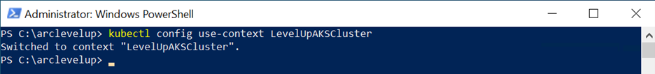

5. Verify the nodes are running

    ```txt
    kubectl get nodes
    ```

    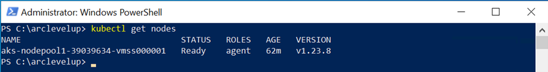

6. Create Resource Group (if you reuse an existing resource group it will modify any metadata but not delete any existing resources)

    ```txt
    az group create --name <RG Name> --location <Region>
    ```

7. Install required extensions

    ```txt
    az extension add --name k8s-extension
    az extension add --name connectedk8s
    az extension add --name k8s-configuration
    az extension add --name customlocation
    ```

    
8. Register required providers

    ```txt
    az provider register --namespace Microsoft.Kubernetes
    az provider register --namespace Microsoft.KubernetesConfiguration
    az provider register --namespace Microsoft.ExtendedLocation
    ```

    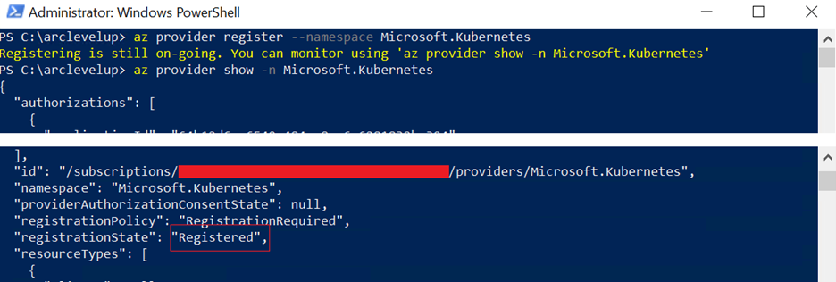
    
    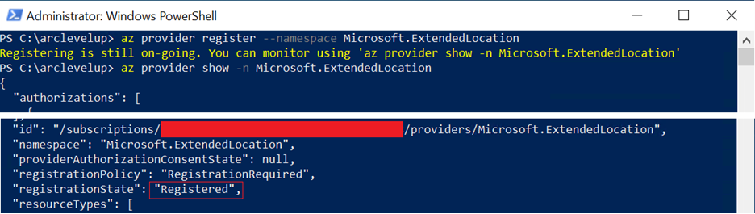

9. Create Azure Direct Connection to the AKS Cluster you will be using to deploy the SQL MI and then review your Resource Group

    ```txt
    az connectedk8s connect --name <AKS Name> --resource-group <RG Name>
    ```

    
    

10. Create Azure AKS Extension with auto upgrade disabled (see **[reference](https://docs.microsoft.com/en-us/cli/azure/k8s-extension?view=azure-cli-latest)** for more info)

    ```txt
    az k8s-extension create --cluster-name <AKS Name> --resource-group <RG Name> --name <Extension Name e.g. arc-dc-ext> --cluster-type connectedClusters --extension-type microsoft.arcdataservices --auto-upgrade false --scope cluster --release-namespace <Namespace e.g. arc-dc-ns> --config Microsoft.CustomLocation.ServiceAccount=<Custom Location Service Account e.g. sa-arc-dc>
    ```

    

11. Get Principal Id from returned JSON

    ```txt
    az k8s-extension show --resource-group <RG Name> --cluster-name <AKSName> --cluster-type connectedClusters --name <Extension Name> --query identity.principalId
    ```

    

12. Add role assignment to Principal Id

    Contributor
    
    ```txt
    az role assignment create --assignee <Principal Id> --role "Contributor" --scope "/subscriptions/<Your Subscription Id>/resourceGroups/<RG Name>"
    ```

    Monitoring Metrics Publisher
    
    ```txt
    az role assignment create --assignee <Principal Id> --role "Monitoring Metrics Publisher" --scope "/subscriptions/<Your Subscription Id>/resourceGroups/<RG Name>"
    ```

    

13. Deploy Custom Location (see **[reference](https://docs.microsoft.com/en-us/cli/azure/customlocation?view=azure-cli-latest)** for more info)

    ```txt
    az customlocation create --resource-group <RG Name> --name <Custom Location Name e.g. arc-dc-cl> --namespace <Namespace> --host-resource-id /subscriptions/<Your Subscription Id>/resourceGroups/<RG Name>/providers/Microsoft.Kubernetes/connectedClusters/<AKS Name> --cluster-extension-ids /subscriptions/<Your Subscription Id>/resourceGroups/<RG Name>/providers/Microsoft.Kubernetes/connectedClusters/<AKS Name>/providers/Microsoft.KubernetesConfiguration/extensions/<Extension Name>
    ```

    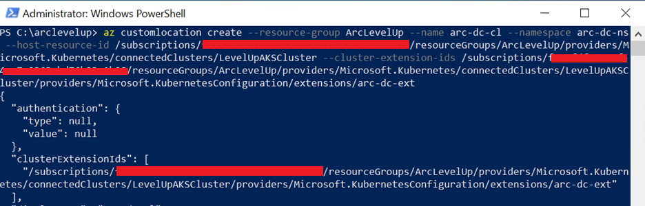

14. Get Log Analytics Workspace Id

    ```txt
    az monitor log-analytics workspace show --resource-group <RG Name> --workspace-name <Log Analytics Workspace Name> --query customerId -o tsv
    ```

    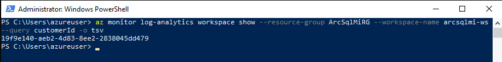

15. Get Log Analytics Workspace Primary Key

    ```txt
    az monitor log-analytics workspace get-shared-keys --name <Log Analytics Workspace Name> --resource-group <RG Name> --query primarySharedKey -o tsv
    ```

    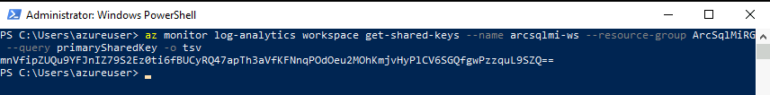

16. Deploy Data Controller using Azure Infrastructure (see **[reference](https://docs.microsoft.com/en-us/cli/azure/arcdata/dc?view=azure-cli-latest)** for more info)

    You will be asked to enter the Log Analytics Workspace Id and Primary Key as well as a username and password for the account that manages the Data Controller (e.g. for monitoring purposes)

    ```txt
    az arcdata dc create --connectivity-mode direct --name <Data Controller Name e.g. arc-dc> --subscription <Your Subscription Id> --resource-group <RG Name> --location <Region> --storage-class managed-premium --profile-name azure-arc-aks-premium-storage --infrastructure azure --custom-location <Custom Location Name> --cluster-name <AKS Name> --auto-upload-logs true --auto-upload-logs true
    ```

    

17. Verify Data Controller (DC) has been created successfully by ensuring new pods have been created for the DC.

    ```txt
    kubectl get pods -n <Namespace>
    ```

    

18. Deploy a Development General Purpose Arc Enabled SQL MI with 1 replica, 2 vCores with a maximum of 4, 4GB of memory with a maximum of 8, managed premium storage for everything apart from backups where managed premium is not available (see **[reference](https://docs.microsoft.com/en-us/cli/azure/sql/mi-arc?view=azure-cli-latest)** for more info)

    You will be asked to enter a username and password for the SQL Admin account

    ```txt
    az sql mi-arc create --name <GP SQL MI Name> --resource-group <RG Name> --custom-location <Custom Location Name> --replicas 1 --cores-request "2" --cores-limit "4" --memory-request "4Gi" --memory-limit "8Gi" --storage-class-data "managed-premium" --storage-class-datalogs "managed-premium" --storage-class-logs "managed-premium" --storage-class-backups "azurefile" --volume-size-data 64Gi --volume-size-datalogs 64Gi --volume-size-logs 5Gi --volume-size-backups 64Gi --tier GeneralPurpose --dev --license-type BasePrice
    ```

    

19. Deploy a Development Business Critical Arc Enabled SQL MI with 3 replicas, 2 vCores with a maximum of 4, 4GB of memory with a maximum of 8, managed premium storage for everything apart from backups

    You will be asked to enter a username and password for the SQL Admin account

    ```txt
    az sql mi-arc create --name <BC SQL MI Name> --resource-group <RG Name> --custom-location <Custom Location Name> --replicas 3 --cores-request "2" --cores-limit "4" --memory-request "4Gi" --memory-limit "8Gi" --storage-class-data "managed-premium" --storage-class-datalogs "managed-premium" --storage-class-logs "managed-premium" --storage-class-backups "azurefile" --volume-size-data 64Gi --volume-size-datalogs 64Gi --volume-size-logs 5Gi --volume-size-backups 64Gi --tier BusinessCritical --dev --license-type BasePrice
    ```

    

20. Verify both Managed Instances were successfully created

    ```txt
    kubectl get services -n <Namespace>
    ```

    Look for entries for \<GP SQL MI Name\>-external-svc and \<BC SQL MI Name\>-external-svc and note the Public IP Addresses (EXTERNAL-IP)

    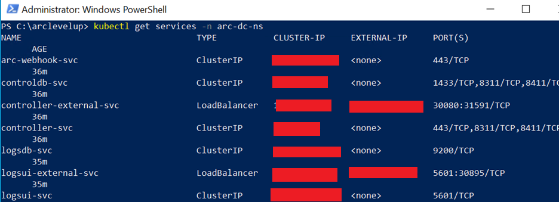

## Connecting to Arc-enabled SQL Managed Instances

1. View Arc-enabled SQL Managed Instances

    ```txt
    az sql mi-arc list --k8s-namespace <namespace> --use-k8s -o table
    ```

    

2. Add NSG rule for your Azure Kubernetes (Microsoft policy may remove the NSG rules that allow you to access several ports publicly so add a new rule using the ip address of your local client and / or jumpbox)

    1. Getting NSG name

     ```txt
     az network nsg list -g <Node RG Name> --query "[].{NSGName:name}" -o table
     ```

    2. Add NSG rule to allow your IP

    ```txt
    az network nsg rule create -n client_rule --destination-port-ranges 1433 --source-address-prefixes "<Client IP; Jumpbox IP>" --nsg-name <NSG Name> --priority 499 -g <Node RG Name> --access Allow --description "Allow port through for db access" --destination-address-prefixes "*" --direction Inbound --protocol Tcp --source-port-ranges "*"
    ```

3. Connect to your Arc-enabled SQL Managed Instances General Purpose

    1. Get the IP Addresses from step 18 (above) and connect to your Arc-enabled SQL MI using SQL Server Management Studio or Azure Data Studio
    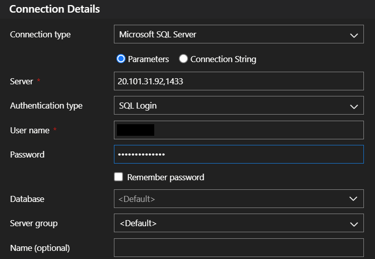

    2. [Connect to Azure Arc-enabled SQL Managed Instance](https://docs.microsoft.com/en-us/azure/azure-arc/data/connect-managed-instance)
    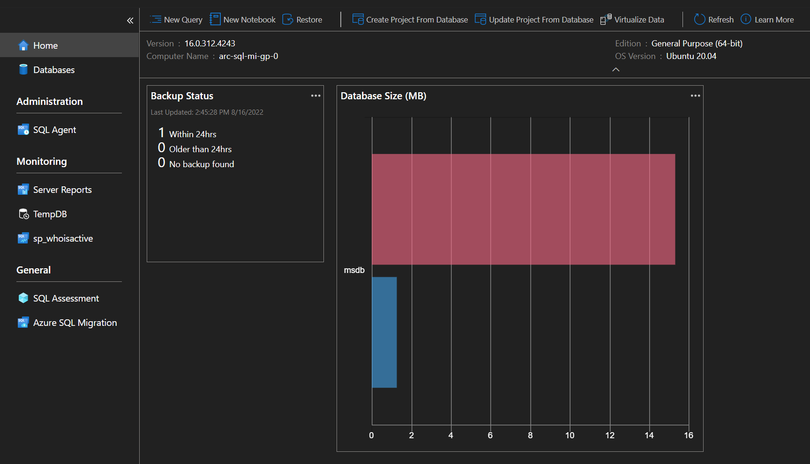

## Upgrading the Arc-enable Data Controller

1. Pull the list of available images for the data controller with the following command:

    ```txt
    az arcdata dc list-upgrades --k8s-namespace <namespace>
    ```

    

2. Upgrade the Arc data controller extension first

   Retrieve the name of your extension and its version

   ```txt
   az k8s-extension list --resource-group <resource-group> --cluster-name <connected cluster name> --cluster-type connectedClusters
    ```

   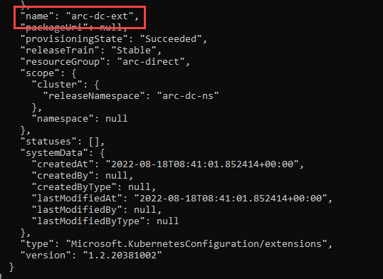

3. Upgrade the extension

    ```txt
    az k8s-extension update --resource-group <resource-group> --cluster-name <connected cluster name> --cluster-type connectedClusters --name <name of extension>
    ```

4. You can perform a dry run before upgrading the Data Controller. The dry run validates the registry exists, the version schema, and the private repository authorization token (if used).

    ```txt
    az arcdata dc upgrade --resource-group <resource group> --name <data controller name> --desired-version <version> --dry-run [--no-wait]
    ```

5. To upgrade the data controller, run the az arcdata dc upgrade command, specifying the image tag with **--desired-version**.

    ```txt
    az arcdata dc upgrade --resource-group <resource group> --name <data controller name> --desired-version <version> [--no-wait]
    ```

6. Monitor the upgrade status

   ```txt
   az arcdata dc status show --name <data controller name> --k8s-namespace <namespace> --use-k8s
   ```

## Upgrading the Arc-enable SQL MI

1. The dry run validates the version schema and lists which instance(s) will be upgraded

   ```txt
   az sql mi-arc upgrade --resource-group <resource group> --name <instance name> --dry-run
   ```

   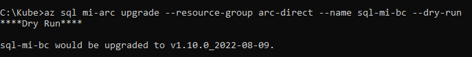

### General Purpose

> [!CAUTION]
> During a **Arc-enable SQL MI General Purpose** upgrade, the pod will be terminated and reprovisioned at the new version. This will cause a short amount of downtime as the new pod is created.

### Business Critical

During a Arc-enable SQL MI Business Critical upgrade with more than one replica:

- The secondary replica pods are terminated and reprovisioned at the new version
- After the replicas are upgraded, the primary will fail over to an upgraded replica
- The previous primary pod is terminated and reprovisioned at the new version, and - becomes a secondary

> [!CAUTION]
> There is a brief moment of downtime when the failover occurs.

1. To upgrade Arc-enable SQL MI, use the following command

    ```txt
    az sql mi-arc upgrade --resource-group <resource group> --name <instance name> --desired-version <imageTag> [--no-wait]
    ```

2. Monitor the progress of the upgrade with the show command

    ```txt
    az sql mi-arc show --resource-group <resource group> --name <instance name>
    ```

    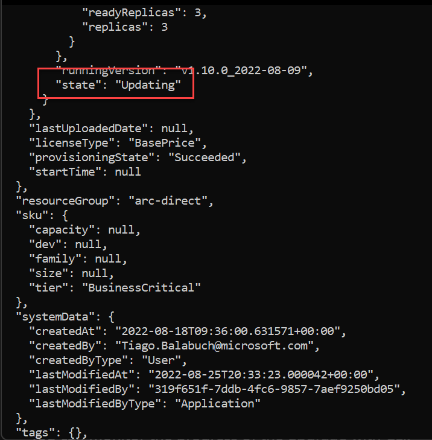

## Enable SQL Server Agent

SQL Server agent is disabled by default.

1. To enable SQL Server Agent run:

    ```txt
    az sql mi-arc update -n <instance name> --k8s-namespace <namespace> --use-k8s --agent-enabled true
    ```

    

2. Verifying if it is enabled

    ```txt
    az sql mi-arc show --resource-group arc-direct --name sql-mi-bc
    ```

    

## Restore a database

### From a Azure Storage Account

1. Download the [AdventureWorks2019 backup file](https://learn.microsoft.com/en-us/sql/samples/adventureworks-install-configure?view=sql-server-ver16&tabs=ssms#download-backup-files)

2. Upload the file to your [Azure Storage Account](https://learn.microsoft.com/en-us/azure/storage/blobs/storage-quickstart-blobs-portal)

3. Create a credential

    [Create SAS tokens](https://docs.microsoft.com/en-us/azure/cognitive-services/translator/document-translation/create-sas-tokens?tabs=Containers)

    ```sql
    USE master
    GO

    IF NOT EXISTS  
    (SELECT * FROM sys.credentials
    WHERE name = 'https://<mystorageaccountname>.blob.core.windows.net/<mystorageaccountcontainername>')  
    BEGIN
        CREATE CREDENTIAL [https://<mystorageaccountname>.blob.core.windows.net/<mystorageaccountcontainername>]
        -- this name must match the container path, start with https and must not contain a forward slash at the end
        WITH IDENTITY = 'SHARED ACCESS SIGNATURE',  -- this is a mandatory string and should not be changed   
        SECRET = '<SAS_TOKEN>';
    END;
    ```

4. Verify the backup file is readable, and intact

    ```sql
    RESTORE FILELISTONLY 
    FROM URL = 'https://<mystorageaccountname>.blob.core.windows.net/<mystorageaccountcontainername>/<file name>.bak'
    ```

    If this fails with error "Operating system error 5(Access is denied.)" this could be an issue with SAS or it could be a network issue.  If your storage account can only be accessed via Firewall rule (selected networks) then you will need to create a service endpoint for the Virtual Network / Subnet in your Kubernetes managed resource group and add to the firewall rule for Virtual Networks

5. Prepare and run the RESTORE DATABASE

    ```sql
    RESTORE DATABASE <database name> FROM URL = 'https://<mystorageaccountname>.blob.core.windows.net/<mystorageaccountcontainername>/<file name>.bak'
    WITH MOVE '<logical data file name>' to '/var/opt/mssql/data/<physical data file name>.mdf'
    ,MOVE '<logical log file name>' to '/var/opt/mssql/data-log/<physical data file name>.ldf'
    ,RECOVERY;  
    GO
    ```

### Copy the backup file into a Kubernetes pod

1. Download the [AdventureWorks2019 backup file](https://learn.microsoft.com/en-us/sql/samples/adventureworks-install-configure?view=sql-server-ver16&tabs=ssms#download-backup-files)

2. Find the primary availability replica

   1. Connect to your Arc-enabled SQL MI
   2. Run this command

        ```sql
        SELECT @@SERVERNAME
        ```

   3. This will be the pod name to be used later
   4. Also, you get the list of all pods by running

        ```txt
        kubectl get pods -n <namespace>
        ```

3. Copy the backup file from the local storage to the sql pod in the cluster

    ```txt
    kubectl cp <source file location> <pod name>:var/opt/mssql/backups/<file name> -n <namespace>
    ```

    > [!IMPORTANT]
    > Replace the <pod name> for the result of sql statement above

    ```text
    kubectl cp \..\temp\AdventureWorks2019.bak sql-mi-gp-0:var/opt/mssql/backups/AdventureWorks2019.bak -n arc-dc-ns
    ```

4. Restore the database

    Prepare the restore command. Use the RESTORE FILELISTONLY command to obtain a list of the files contained in a backup set.

    ```sql
    RESTORE FILELISTONLY
    FROM DISK = '/var/opt/mssql/backups/AdventureWorks2019.bak';
    GO
    ```

    Run the RESTORE DATABASE command.

    ```sql
    RESTORE DATABASE AdventureWorks2019
    FROM DISK = '/var/opt/mssql/backups/AdventureWorks2019.bak'
    WITH
        MOVE <logical name>
        TO '/var/opt/mssql/data/AdventureWorks2019.mdf'
    , MOVE <logical name>
        TO '/var/opt/mssql/data-log/AdventureWorks2019_log.ldf'
    , RECOVERY;
    GO
    ```

    > [!IMPORTANT]
    > Replace the <logical name> for the logical name of each file

    ```sql
    RESTORE DATABASE AdventureWorks2019
    FROM DISK = '/var/opt/mssql/backups/AdventureWorks2019.bak'
    WITH
        MOVE 'AdventureWorks2017'
        TO '/var/opt/mssql/data/AdventureWorks2019.mdf'
    , MOVE 'AdventureWorks2017_log'
        TO '/var/opt/mssql/data0log/AdventureWorks2019_log.ldf'
    , RECOVERY;
    GO
    ```

## Transparent Data Encryption (TDE)

Turning on transparent data encryption in Arc-enable SQL MI follows the same steps as SQL Server on-premises.

Use the following steps to [enable TDE](https://docs.microsoft.com/sql/relational-databases/security/encryption/transparent-data-encryption?view=sql-server-ver16#enable-tde).

> [!WARNING]
> If you are performing a **point-in-time restore (PITR)**, there is no support for restoring a TDE enabled database currently.

```sql
USE master;
GO

CREATE MASTER KEY ENCRYPTION BY PASSWORD = 'UseStrongPasswordHere!';
GO

CREATE CERTIFICATE MyServerCert WITH SUBJECT = 'My DEK Certificate';
go

USE AdventureWorks;
GO

CREATE DATABASE ENCRYPTION KEY
WITH ALGORITHM = AES_256
ENCRYPTION BY SERVER CERTIFICATE MyServerCert;
GO

ALTER DATABASE AdventureWorks
SET ENCRYPTION ON;
GO

USE AdventureWorks;
GO
/* The value 3 represents an encrypted state
   on the database and transaction logs. */
SELECT *
FROM sys.dm_database_encryption_keys
WHERE encryption_state = 3;
GO
```

### Back up a transparent data encryption credential

1. Back up the certificate from the container to /var/opt/mssql/data

    ```sql
    USE master;
    GO

    BACKUP CERTIFICATE MyServerCert TO FILE = '/var/opt/mssql/backups/MyServerCert.cert'
    WITH PRIVATE KEY ( FILE = '/var/opt/mssql/backups/private.key',
    ENCRYPTION BY PASSWORD = 'UseStrongPasswordHere!');
    ```

2. Copy the certificate from the container to your file system

    |operating System  | Command  | Example |
    |---------  |---------|---------|
    |Windows     | `kubectl exec -n <namespace> -c arc-sqlmi <pod-name> -- cat <pod-certificate-path> > <local-certificate-path>`   | `kubectl exec -n arc-idc-ns -c arc-sqlmi arc-sql-mi-gp-0 -- cat /var/opt/mssql/data/myservercert.crt > \..\temp\sqlcerts\myservercert.crt` |
    |Linux     |    `kubectl cp --namespace <namespace> --container arc-sqlmi <pod-name>:<pod-certificate-path> <local-certificate-path>` | `kubectl cp --namespace arc-idc-ns --container arc-sqlmi arc-sql-mi-gp-0:/var/opt/mssql/data/servercert.crt $HOME/sqlcerts/myservercert.crt` |

    To get pods name use this command

    ```txt
    kubectl get pods -n <namespace>
    ```

3. Copy the private key from the container to your file system

    |operating System  |Command  | Example |
    |---------|---------|---------|
    |Windows     |  `kubectl exec -n <namespace> -c arc-sqlmi <pod-name> -- cat <pod-private-key-path> > <local-private-key-path>`   |`kubectl exec -n arc-idc-ns -c arc-sqlmi arc-sql-mi-gp-0 -- cat /var/opt/mssql/data/myservercert.key > \..\temp\sqlcerts\myservercert.key`|
    |Linux     |  `kubectl cp --namespace <namespace> --container arc-sqlmi <pod-name>:<pod-private-key-path> <local-private-key-path>`        | `kubectl cp --namespace arc-idc-ns --container arc-sqlmi arc-sql-mi-gp-0:/var/opt/mssql/data/myservercert.key $HOME/sqlcerts/myservercert.key`|

## High Availability

### Verify built-in high availability

Use the following steps to test [HA](https://learn.microsoft.com/en-us/azure/azure-arc/data/managed-instance-high-availability).

1. View the pods for your SQL MI

    ```txt
    kubectl get pods -n <namespace>
    ```

2. Delete one of the pods for your SQL MI
    ```txt
    kubectl delete pod <pod name> -n <namespace>
    ```

3. View the pods again to verify that the MI is recovering

    ```txt
    kubectl get pods -n <namespace>
    ```

    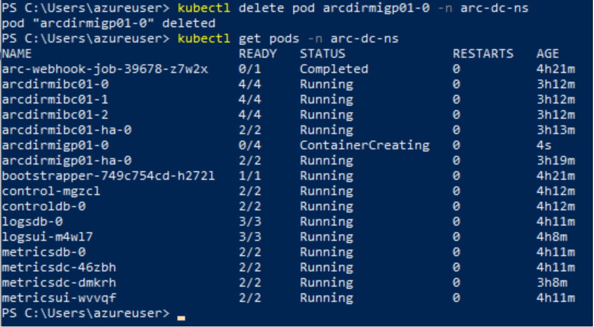

    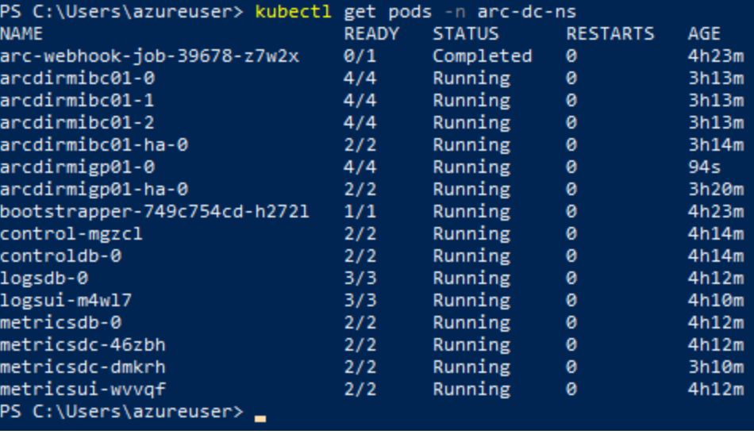

### Checking High availability Replicas

```sql
SELECT * FROM sys.dm_hadr_availability_replica_states
```

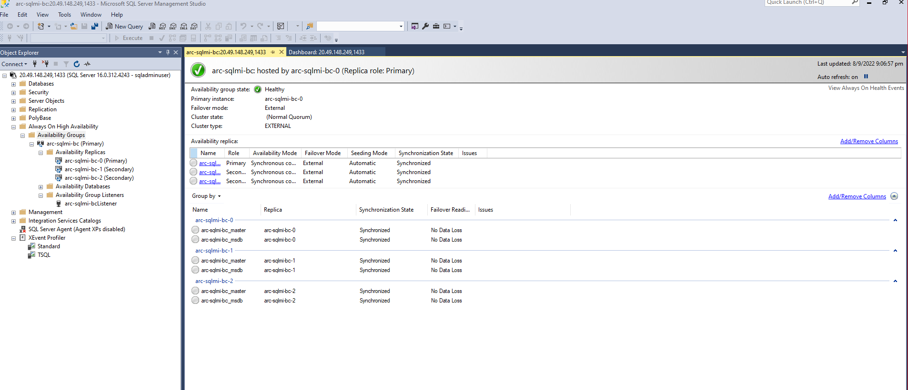

## Failover scenarios

To fail over from the primary replica to one of the secondaries, for a planned event, run the following command:

If you connect to primary, you can use following T-SQL to fail over the SQL instance to one of the secondaries:

```sql
ALTER AVAILABILITY GROUP current SET (ROLE = SECONDARY);
```

Primary-to-secondary

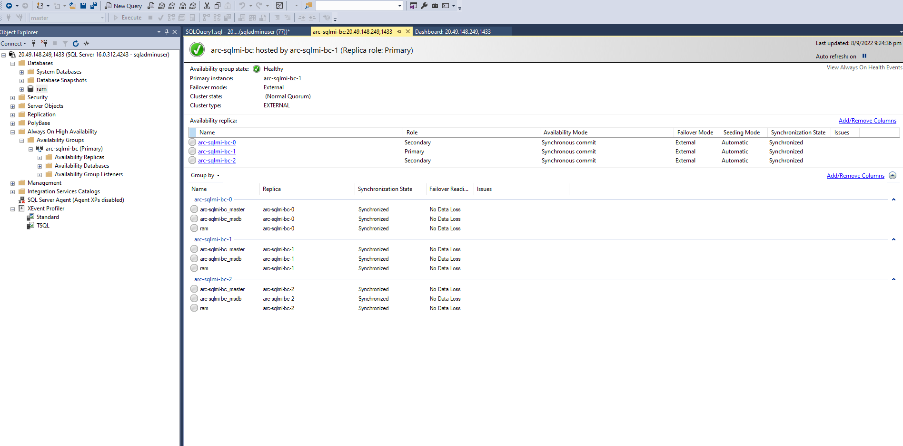

If you connect to the secondary, you can use following T-SQL to promote the desired secondary to primary replica.

```sql
ALTER AVAILABILITY GROUP current SET (ROLE = PRIMARY);
```

Secondary-to-primary

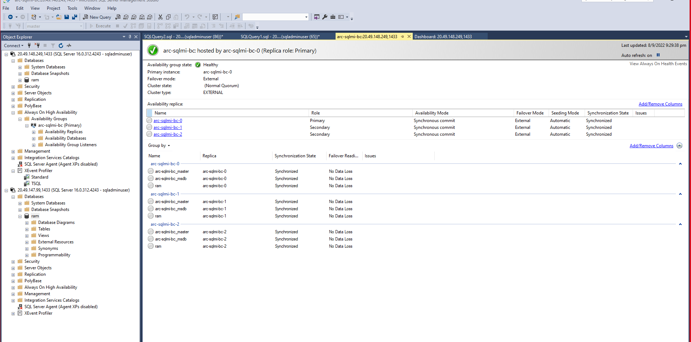

## Monitoring using Grafana

1. Open Azure Data Studio

2. Install the Azure Arc Extension

    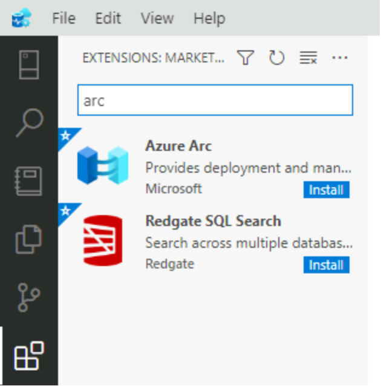

3. Go to Azure Arc Controllers and click Connect Controller

    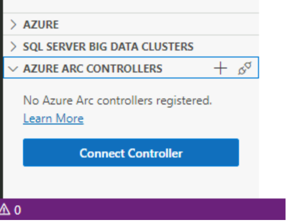

4. Enter the namespace and select the data controller, then click Connect

    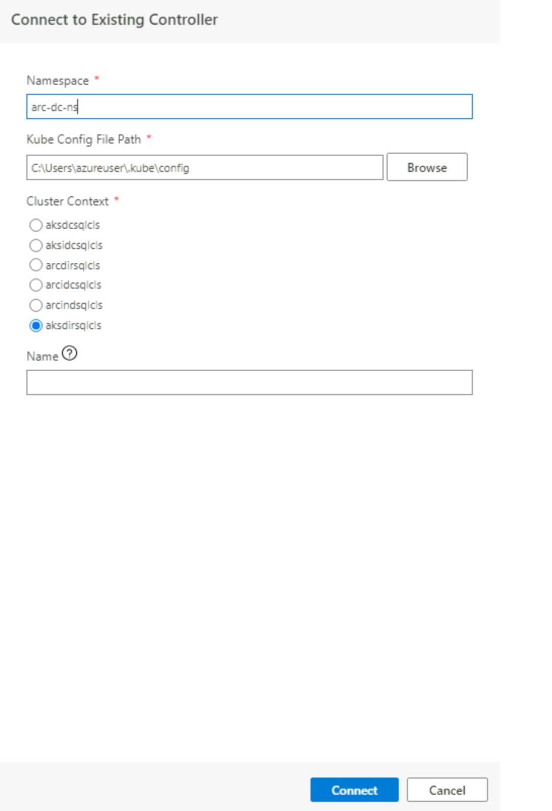

5. Right click the controller from the Azure Arc Controllers panel and select Manage

    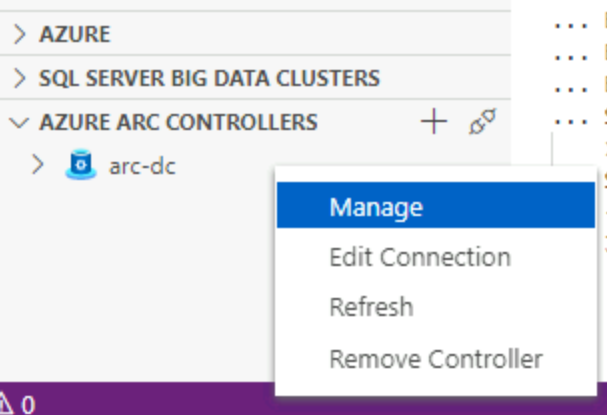

6. Your controller will appear with a list of your SQL Managed Instances.  Select the MI you would like to monitor

    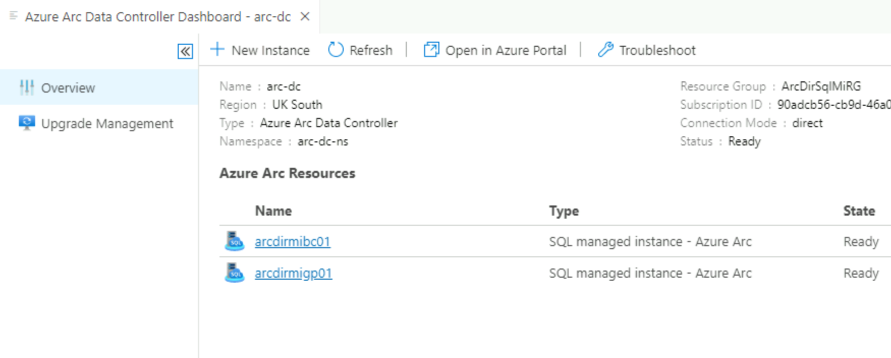

7. On the Overview page you are given a link to monitor via Grafana or to view the logs using Kibana.

    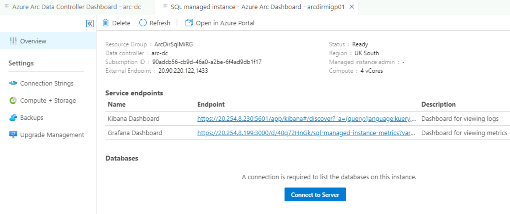

8. Selecting either link will take you to a page where you will need to enter credentials.  You provided the username and password when you created the Data Controller.

    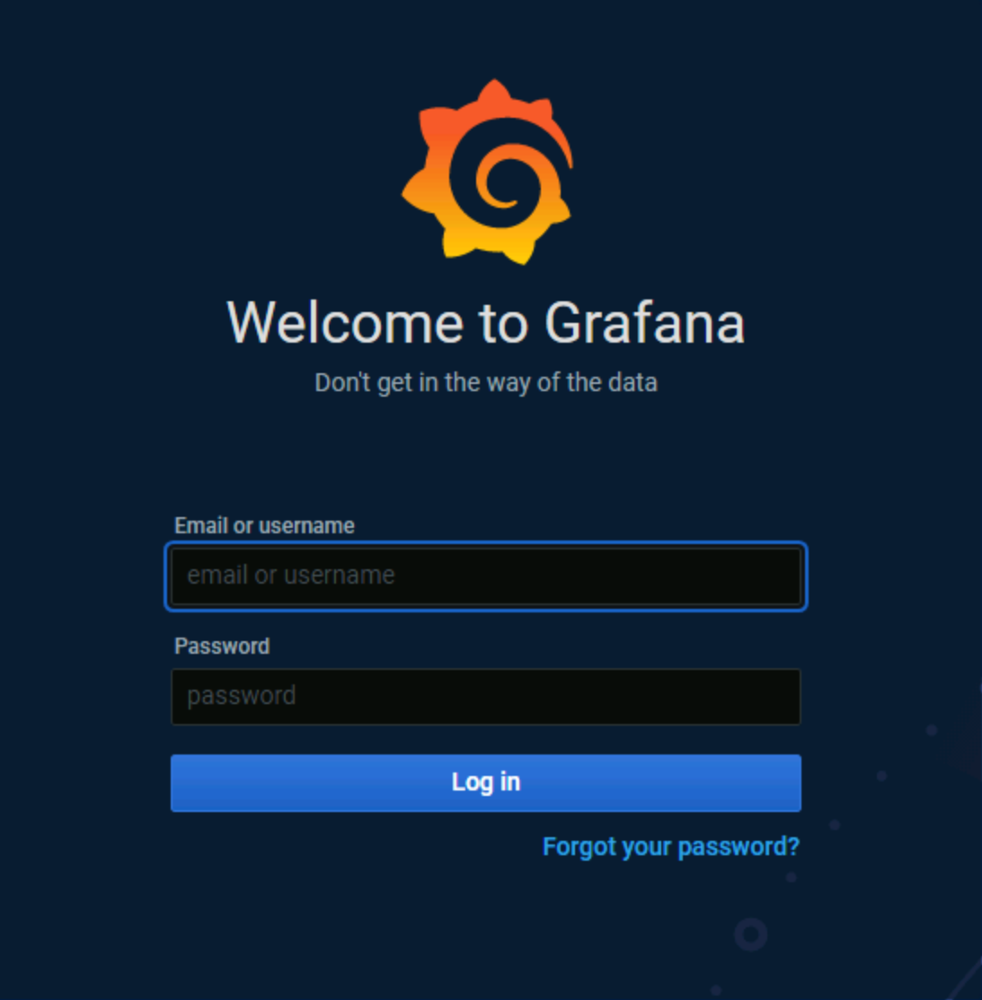

9. Once logged in you will be taken to the Grafana or Kibana dashboard

    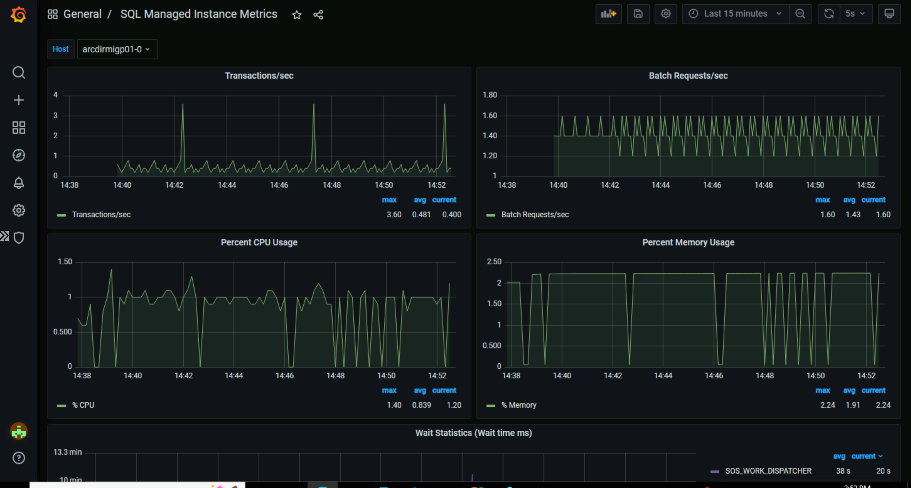

    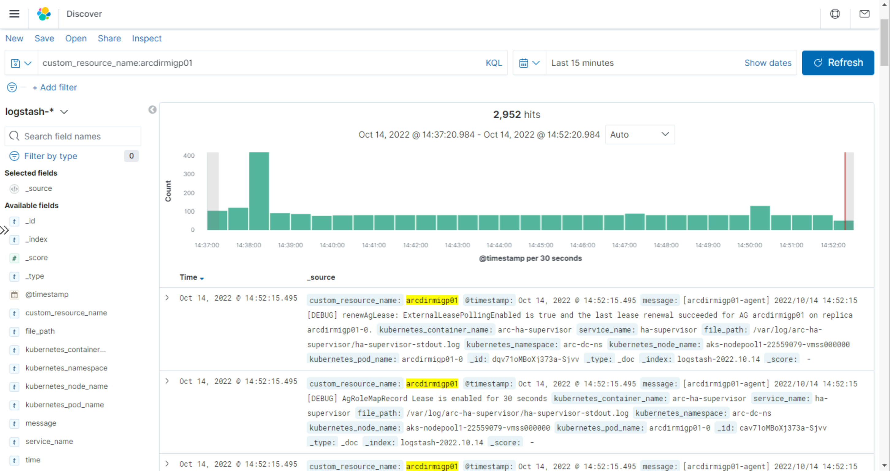
